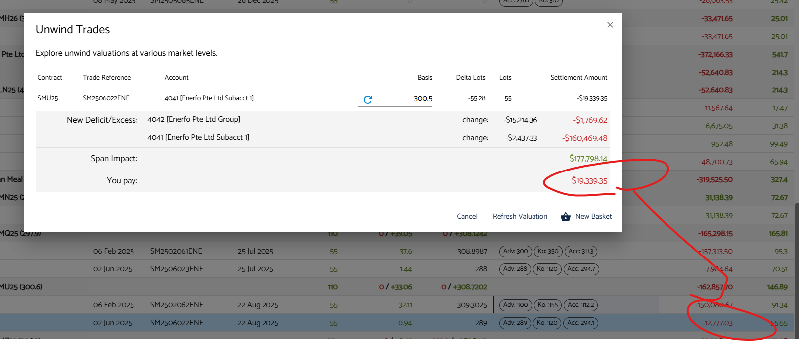

vol charges (vega) are applied when unwinding / settling a position. Differences between MTM shown in porfolio manager, and the settlment amount when unwinding are expected, and will vary by contract.

e.g. this is correct when factoring in vol charges.

