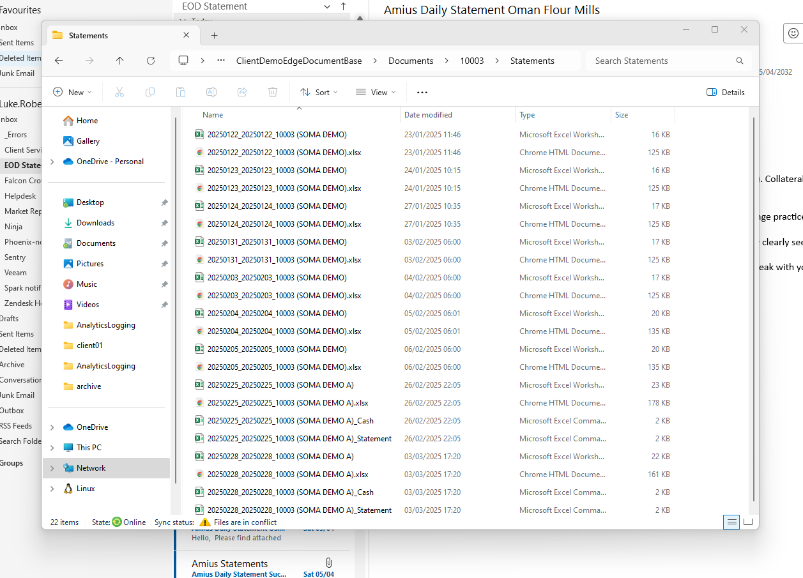

# demo eod

Demo has a copy job that copies various static data from production using a linked server. This runs on demo-sql01 and is triggered by a Argo Workflow. Search for `daily-demo-restore`.

This job also runs the EOD valuations and a daily cut. Other daily runs are scheduled via VC.

login to argo using argocd admin creds in RDM

valuations are generated as part of EOD - this is managed through argo-workflows for now and happens at 05:30am every day 
this is these files in this folder `\\am2-file02\OTC\Phoenix\ClientDemoValuations`

note - often have syncing issues between am1-file01 and am2-file02. A temporary solution has been to copy stuff across from 01 -> 02

if need to re-run demo eod, https://argo-workflows.amius.com/cron-workflows/argo-workflows/daily-demo-restore

## demo statements

demo statements generation is a visual cron job, which runs at 06:00 am
 
all that job actually does is call an endpoint on the website (otc.amius.com or demo-otc.amius.com) which generates all of the client statements and sends them out
  
so you have EOD -> Valuations files -> Generate statements (requires these valuations files) -> StatementsAutomation folder files 
  
For reference, there is then an additional job that runs at some interval which picks up these statements files and drops them in a folder used by the relevant documents service to serve these documents in edge 



## bad demo eod data

SQL query to find trades that are LIVE but are past their expiry date

```
SELECT t.*, p.*
FROM Phoenix..OtcTradePosition p
JOIN Phoenix..OtcTrade t ON p.otcTrade_fk = t.otcTrade_id
WHERE p.expiryDateTime <= CAST(GETDATE() AS DATE) AND t.status_fk = 'LIVE' AND sys_isLatest = 1
ORDER BY internalAccount_fk desc
```