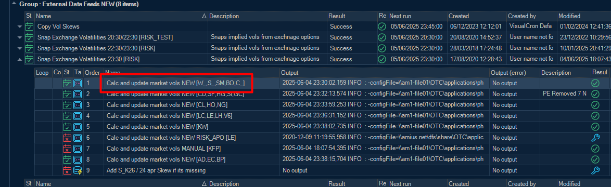
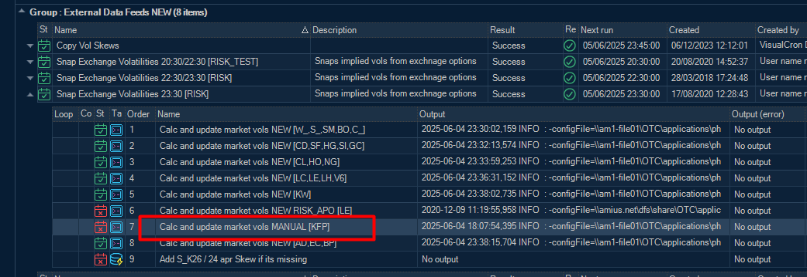
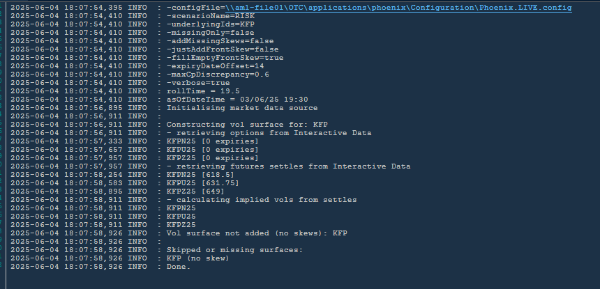
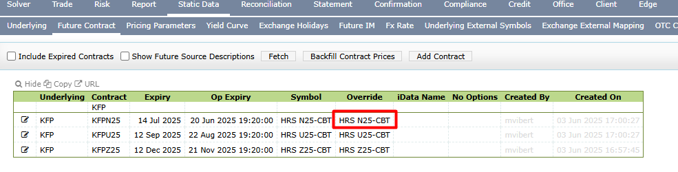
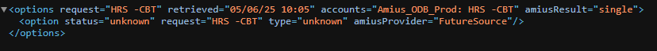
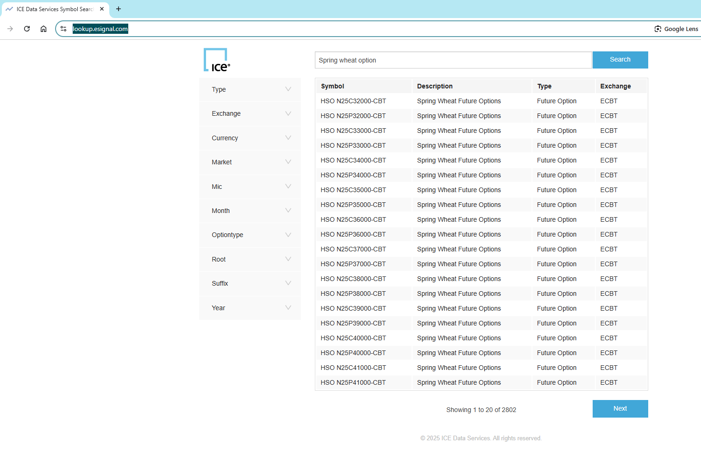
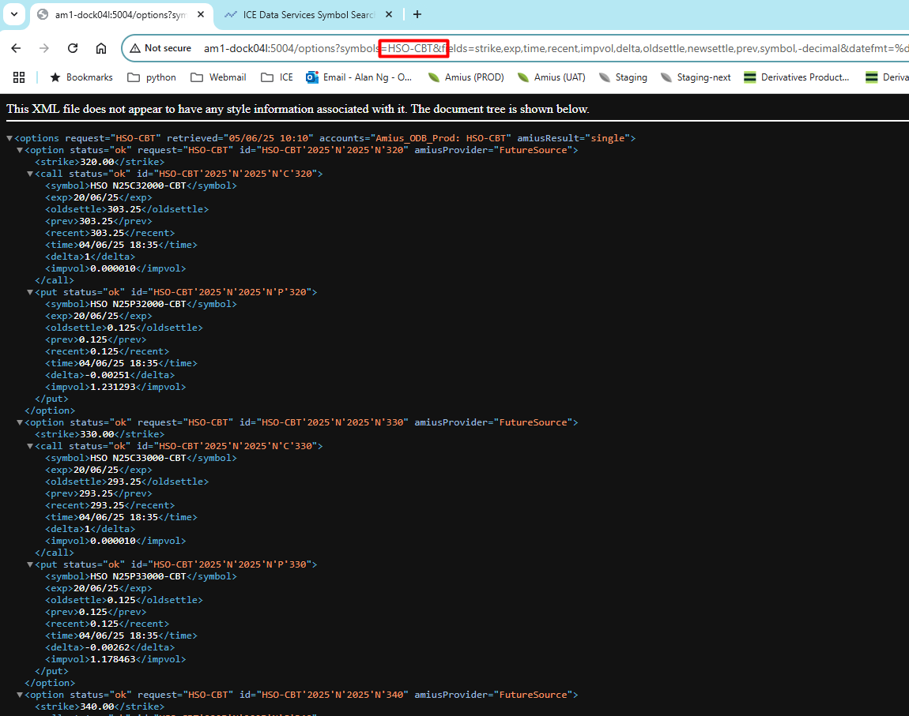

# implied vols

This is a bigger problem than normal. But how to chase this down ... Implied vols are snapped overnight by a batch job in a number of VC tasks (which are long overdue some housekeeping). These are loosely grouped by exchange so this is where we'd likely add KFP ... 

 
I would normally test this with this task (basically just run for KFP) ....

 
If you are worried about existing surfaces you can save to a different scenario name eg -scenarioName="TEST_AL"
 
In this case no option prices were available for KFP

 
ICE data symbol we have for KFP is HRS -CBT. **Note, make amends on otc.amius rather than next. Next doesnt work ...**

 
So we can check MDS directly ....
 
http://am1-dock04l:5004/options?symbols=HRS+-CBT&fields=strike,exp,time,recent,impvol,delta,oldsettle,newsettle,prev,symbol,-decimal&datefmt=%d/%m/%y&timefmt=%d/%m/%y%20%H:%M&type=optfut
 
and nothing is returned

 
 
some digging around on the symbol lookup for ICE ...
 
https://lookup.esignal.com/
 
we can see that the options have a different symbol!

 
which we can then check ...

