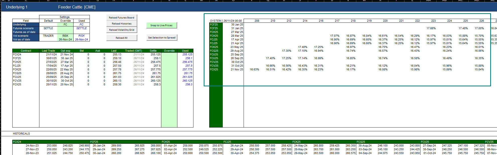

# missing vols

This is a common source of issues. For example, if statements can't be loaded because things aren't valueing properly, a good first thing to check is that vols are in order. It's also good to check that the expiry date on the contract and trades are correct, we have had issues in the past with incorrect option expiries provided from ICE!

Load the the phoenix session and navigate to MarketData. Load the contract and select RISK vol scenario (amend the overrides) and make sure that vols are loaded for the future contract you are investigating. Missing vols will result in trades not valueing properly which will cause issues with statements.

See area highlighted in the blue box on the right of the image below for the vols section.

E.g. When the pic below was taken, we were missing vols for FCH25 27 Mar 25, which was causing statements to fail.

Ask the traders to fix any issues with the vols, check that the trades are valuing properly in Phoenix (go to OTC Trade and look up by trade ref). Once everything is valuing, EOD will need to be re-run for the books that had issues. (Infra usually do this).