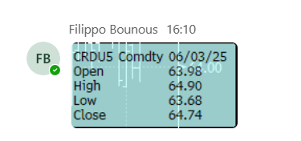
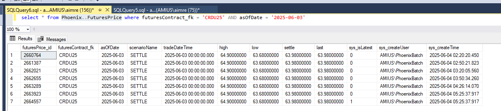

# bad price data

- sometimes prices are wrong and need to be overwritten. Get accurate data from traders. In this example, the settle price was incorrect.
- `exec Phoenix..usp_addFuturesPrice 'CRDU25', 'SETTLE', '3 jun 2025', 64.74, 64.90, 64.68, 64.74, '3 jun 2025'`
- clear SettlePrice cache https://otc.amius.com/Admin/Cache/Index

